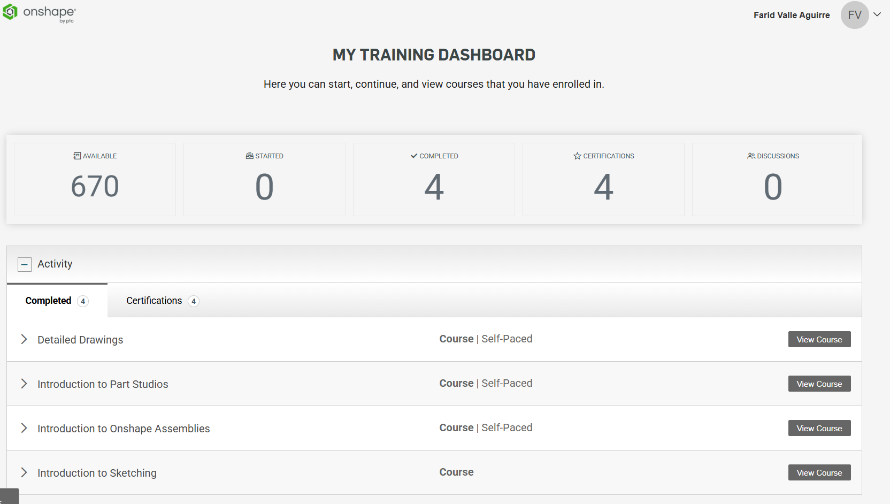
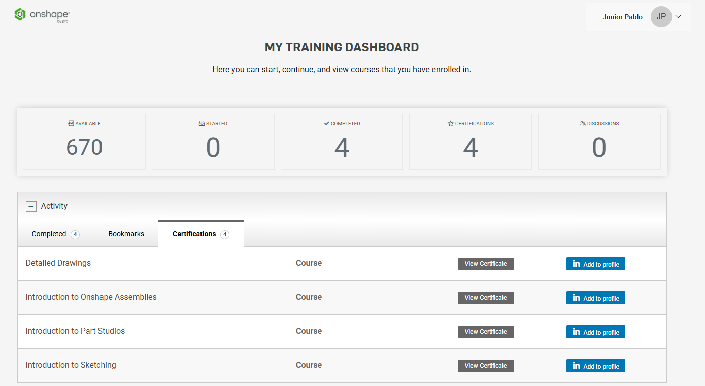

# Certificados de Capacitación en Onshape

En esta sección se presentan las certificaciones y cursos completados en el panel de capacitación de Onshape por **Farid Valle Aguirre**:

- **Cursos completados (4):**
  - *Introduction to Sketching*
  - *Introduction to Part Studios*
  - *Introduction to Onshape Assemblies*
  - *Detailed Drawings*

*Farid Valle*

---
*Junior Pablo*

