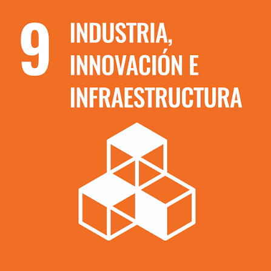

# FdD_Equipo_09 
### Carrera de Ingeniería Industrial / Informática / Ambiental  
**Universidad Peruana Cayetano Heredia**

---.

## 🌍 Descripción del Equipo 
Somos el **Equipo 09** del curso **Fundamentos de Diseño**, conformado por estudiantes de la carrera de Industrial / Ambiental e Informática.  
Nuestro objetivo es aplicar la metodología de diseño para generar soluciones innovadoras con impacto social, tecnológico y ambiental.  

Nos interesa trabajar en los siguientes **Objetivos de Desarrollo Sostenible (ODS):**  
proyecto-ods/
## 🌱 Objetivos de Desarrollo Sostenible (ODS)

Trabajaremos con los siguientes ODS:

### ODS 09 - Industria, Innovación y Sostenibilidad

### ODS 11 - Ciudades y Comunidades Sostenibles

### ODS 12 - Producción y Consumo Responsables

---

## 📸 Fotografía del Equipo  

---

## 👥 Integrantes del Equipo  

| Foto | Nombre | Rol | Intereses |
|------|--------|-----|-----------|
Yalef Gabriel Moncca Rodríguez
