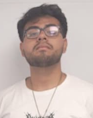
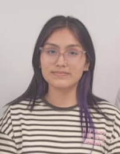
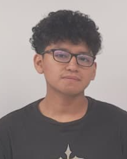
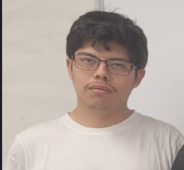
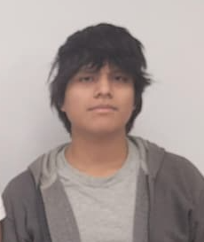

# FdD_Equipo_09 
### Carrera de Ingeniería Industrial / Informática / Ambiental  
**Universidad Peruana Cayetano Heredia**

---.

## 🌍 Descripción del Equipo 
Somos el **Equipo 09** del curso **Fundamentos de Diseño**, conformado por estudiantes de la carrera de Industrial / Ambiental e Informática.  
Nuestro objetivo es aplicar la metodología de diseño para generar soluciones innovadoras con impacto social, tecnológico y ambiental.  

Nos interesa trabajar en los siguientes **Objetivos de Desarrollo Sostenible (ODS):**  
proyecto-ods/
## 🌱 Objetivos de Desarrollo Sostenible (ODS)

Trabajaremos con los siguientes ODS:

### ODS PRINCIPAL 
### ODS 13 - Acción por el clima 
Busca fortalecer la resiliencia y la capacidad de adaptación a los riesgos relacionados con el clima, integrar medidas en políticas y estrategias nacionales, y mejorar la educación y la conciencia sobre el cambio climático. La reducción de emisiones de gases de efecto invernadero es clave para limitar el calentamiento global.
Esta ODS se enfoca en tomar medidas urgentes para combatir el cambio climático y sus impactos. La medición y control de gases de efecto
invernadero, como el metano producido en tanques de tratamiento, contribuye directamente a esta meta.
### Meta 13.2: Integrar medidas relativas al cambio climático en las políticas, estrategias y planes nacionales.
### Meta 13.3: Mejorar la educación, la sensibilización y la capacidad humana e institucional respecto a la mitigación del cambio climático.

### ODS RELACIONADAS 
### ODS 09 - Industria, Innovación y Sostenibilidad
Porque el proyecto implica el desarrollo e implementación de tecnologías innovadoras para el monitoreo ambiental.
Promueve la construcción de infraestructuras resilientes, la industrialización sostenible y la innovación tecnológica
para impulsar el desarrollo económico y mejorar la calidad de vida.
### Meta 9.4: Modernizar la infraestructura y reconvertir las industrias para que sean sostenibles, con mayor eficiencia en el uso de recursos y mayor adopción de tecnologías limpias.

### ODS 11 - Ciudades y Comunidades Sostenibles
Pretende lograr que las ciudades y los asentamientos humanos sean inclusivos, seguros, resilientes y sostenibles, mejorando la calidad del aire y reduciendo la contaminación.
Al contribuir a la reducción de contaminantes atmosféricos, se mejora la calidad de vida en comunidades urbanas y rurales.
### Meta 11.6: Reducir el impacto ambiental negativo per cápita de las ciudades, prestando especial atención a la calidad del aire.

### ODS 12 - Producción y Consumo Responsables
Busca asegurar modalidades de consumo y producción sostenibles, reduciendo la generación de desechos y promoviendo el uso eficiente de los recursos.
Relacionado con la gestión sostenible de residuos y la reducción de emisiones contaminantes en procesos industriales y de tratamiento.
### Meta 12.4: Lograr la gestión ambientalmente racional de los productos químicos y todos los desechos a lo largo de su ciclo de vida.

---
### Delimitación del tema o problemática a abordar 
En los procesos de tratamiento de aguas residuales, los tanques de tratamiento pueden generar metano y otros gases que contribuyen al efecto invernadero. Sin embargo, la medición y monitoreo continuo de estas emisiones no siempre se realiza de manera eficiente o sistemática, lo que dificulta la implementación de estrategias efectivas para su mitigación.

La problemática que abordaremos se centra en la necesidad de desarrollar sistemas tecnológicos que permitan sensar y cuantificar con precisión la cantidad de gases de efecto invernadero producidos en las profundidades de los tanques de tratamiento. Este monitoreo es crucial para entender mejor las emisiones, evaluar su impacto ambiental y apoyar la toma de decisiones para reducirlas.
---

## 📸 Fotografía del Equipo  

---

## 👥 Integrantes del Equipo  

| Foto | Nombre | Rol | Intereses |
|------|--------|-----|-----------|
| | **Gabriel Yalef Moncca Rodriguez** | Líder del equipo | Innovación social, sostenibilidad |
| | **Yamileth Anahi Tenorio Inocente** | Responsable de investigación |Generación de conocimiento útil, innovación con próposito, sostenibilidad integral|
|  | **Farid Alexandre Valle Aguirre** | Diseñador/a | Diseño de prototipos, creatividad aplicada |
|  | **Harold Dair Avilez Salinas** | Encargado/a de documentación | Comunicación científica, organización de la información,redacción técnica y síntesis de contenidos |
|  | **Junior Orlano Pablo Firma** | Programador/a - Modelador/a | Programación, análisis de datos, simulación |
